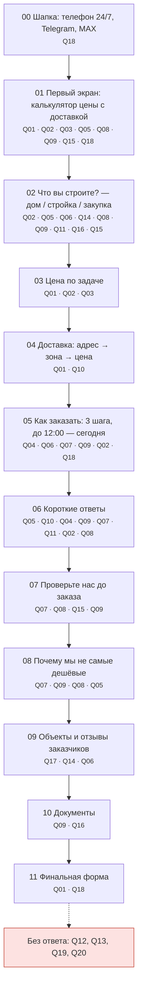
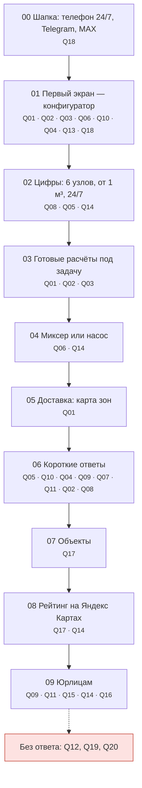
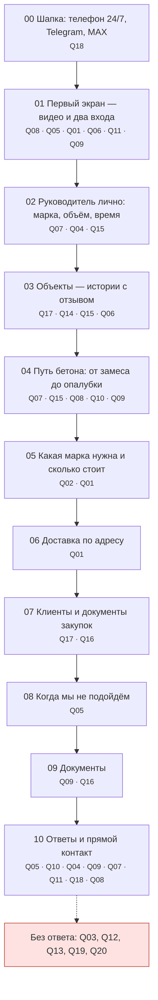
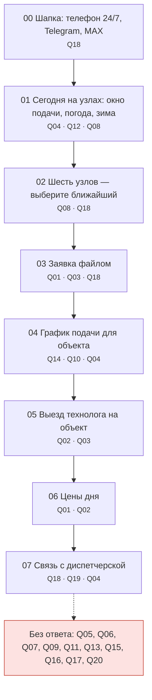
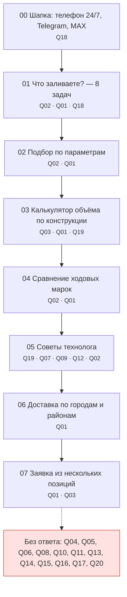
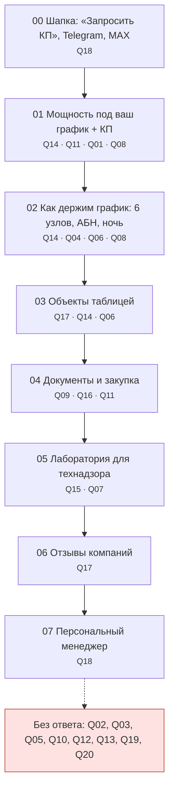

# ЦА: вопросы клиентов и блок-схемы вариантов П1–П6

Тот же материал в Figma: [страница «ЦА и блок-схемы»](https://www.figma.com/design/juFVw7SDIxDw0StkPZCTHH/?node-id=136-2). Варианты главной: [«Прототипы главной · по анализу»](https://www.figma.com/design/juFVw7SDIxDw0StkPZCTHH/?node-id=117-2).

**Содержание:** [Как собрано](#как-собрано) · [Сегменты](#сегменты-и-что-о-них-известно) · [20 вопросов](#20-вопросов-клиента) · [Покрытие](#покрытие-вопросов-по-вариантам) · [Блок-схемы](#блок-схемы-вариантов) · [Гайд для интервью](#гайд-для-настоящих-интервью) · [Источники](#источники)

## Как собрано

- **Настоящих интервью здесь нет.** Людей и цитаты не придумывали. Раздел «Гайд для настоящих интервью» — что спросить у 5–7 клиентов каждого сегмента; ответы добавим в эту таблицу.
- **Голос клиента** — только проверяемое: вопросы из блоков FAQ на главных 20 доступных конкурентов (сняты нашим скриптом, `competitors/audit/`), жалобы из отзывов, статьи о выборе поставщика.
- FAQ конкурентов — это вопросы, которые заводы **сами** вынесли на сайт. Сигнал косвенный, но повторяющийся у разных компаний.
- Ссылки со звёздочкой (`S12*`) — страница закрыта для нашей рабочей среды, факт взят из поисковой выдачи. Перед показом клиенту открыть и перепроверить.
- Сегменты — гипотеза: ksg-beton прямо делит клиентов на частных заказчиков, подрядчиков и организации [S02](https://ksg-beton.ru/), обзор рынка говорит, что основной спрос даёт B2B [S20*](https://alto-group.ru/otchot/rossija/679-rynok-tovarnogo-betona-v-rossii-tekuschaja-situacija-i-prognoz-2022-2026-gg.html). Долю сегментов у нашего клиента нужно взять из его заявок и CRM.
- Какой блок на какой вопрос отвечает — разобрано по тексту самих макетов П1–П6 в Figma.

## Сегменты и что о них известно

### С1 · Строю дом

Частный заказчик: фундамент, плита, перекрытие своего дома. Основание сегмента: [S02](https://ksg-beton.ru/)

**Что говорят и спрашивают:**

- Какую марку выбрать (в том числе для фундамента) — вопрос есть в FAQ у четырёх конкурентов. [S02](https://ksg-beton.ru/) [S03](https://gstbeton.ru/) [S07](https://beton-mos.ru/) [S06](https://www.vitoria.ru/)
- Спрашивают, как рассчитать нужный объём и помогут ли с расчётом. [S02](https://ksg-beton.ru/) [S07](https://beton-mos.ru/)
- Спрашивают, от чего зависит цена и как считается итоговая стоимость (марка, объём, адрес, насос). [S01](https://gmr-beton.ru/) [S02](https://ksg-beton.ru/) [S07](https://beton-mos.ru/)
- Боятся перекупщиков: те дают низкую цену за счёт заниженной марки и обмана в объёме; совет — брать у ближайшего завода. [S08*](https://www.forumhouse.ru/journal/themes/333-kak-obmanyvayut-na-zakupke-materialov-serye-shemy-i-kak-s-nimi-borotsya)
- Реальный отзыв: заказали 28 м³, привезли на 8 м³ меньше, пришлось доплатить почти 60 000 ₽. [S09*](https://otzovik.com/reviews/zavod_omega_beton_russia_moskovskaya/)
- Спрашивают, как проверить объём и класс привезённого бетона и что делать, если марка не та. [S06](https://www.vitoria.ru/) [S05](https://mosbetontorg.ru/)
- Советуют смотреть на лабораторию завода и на отсутствие доплаты за полупустую машину; отзывам не верить слепо. [S11*](https://znaet.petrovich.ru/stroitelstvo/fundament-podval/lentochnyy-fundament/obzor/oshibki-pri-pokupke-betona/)
- Спрашивают, можно ли бетонировать зимой. [S06](https://www.vitoria.ru/)

**Вопросы сегмента:** Q01 Сколько будет стоить с доставкой ко мне?, Q02 Какая марка мне нужна?, Q03 Сколько кубов заказать?, Q06 Миксер подъедет или нужен насос — и сколько он стоит?, Q07 Как убедиться, что марка и объём честные?, Q08 Вы сам завод или перекупщик?, Q12 Можно заливать зимой и что для этого нужно?, Q15 Есть своя лаборатория, пробы и протоколы?, Q17 Кому вы уже возили и что они говорят?

### С2 · Мелкий объём

Частник с небольшой задачей: отмостка, дорожка, пол гаража, столбы. Основание сегмента: [S04](https://bz-titan.ru/) [S05](https://mosbetontorg.ru/) [S07](https://beton-mos.ru/)

**Что говорят и спрашивают:**

- Спрашивают минимальный объём заказа — вопрос в FAQ у трёх конкурентов. [S04](https://bz-titan.ru/) [S05](https://mosbetontorg.ru/) [S07](https://beton-mos.ru/)
- Если нужно меньше, чем вмещает миксер, поставщики берут доплату за недогруз — машина едет полупустой. [S12*](https://xn----7sbafgq7cdioyd.xn--p1ai/staty/91-skolko-stoit-dostavka-betona-mikserom) [S11*](https://znaet.petrovich.ru/stroitelstvo/fundament-podval/lentochnyy-fundament/obzor/oshibki-pri-pokupke-betona/)
- Спрашивают про самовывоз с завода. [S02](https://ksg-beton.ru/) [S05](https://mosbetontorg.ru/)
- Спрашивают, работает ли завод с частными лицами, а не только с организациями. [S02](https://ksg-beton.ru/)

**Вопросы сегмента:** Q01 Сколько будет стоить с доставкой ко мне?, Q05 Возите мало? Будет доплата за недогруз?, Q11 Как платить: частнику и юрлицу, с НДС, с отсрочкой?, Q20 Можно забрать самовывозом?

### С3 · Прораб / бригада

Тот, кто принимает бетон на объекте: бригадир, прораб. Отвечает за время и приёмку. Основание сегмента: [S10*](https://otzovik.com/reviews/voskresenskiy_betonniy_zavod_russia_voskresensk/) [S13*](https://udarnik.spb.ru/dostavka_spb/)

**Что говорят и спрашивают:**

- Реальные отзывы: доставку переносили несколько раз, бетон не приехал, бригада простояла весь день. [S10*](https://otzovik.com/reviews/voskresenskiy_betonniy_zavod_russia_voskresensk/)
- Норма разгрузки миксера — около 60 минут, дальше платный простой (пример: 3 600 ₽/ч). [S13*](https://udarnik.spb.ru/dostavka_spb/)
- Объём честно проверяется по весу: вес пустой и полной машины, весовая распечатка. [S14*](https://betonneva.ru/dlya_pokupatelya/kak_proverit_kubaturu_betona_pri_dostavke/)
- Не каждую смесь берёт бетононасос: насосники неохотно качают М150 и ниже; решает подвижность П4–П5. [S18*](https://m350.ru/faq/2/)
- Частая ошибка — доливать воду в смесь на объекте. [S22*](https://beton-24.by/4-kriticheskie-oshibki-kotorye-dopuskayut-stroiteli-pri-zalivke-betona/) [S03](https://gstbeton.ru/)
- Спрашивают, сколько бетона остаётся в миксере после выгрузки. [S19*](https://gk-betonstroi.ru/ugolok-potrebitelya/skolko-kubov-v-miksere-betona-skolko-betona-ostaetsya-v-miksere-posle-vygruzki/)
- Зимой нужны противоморозные добавки и прогрев. [S17*](https://m350.ru/faq/5/)

**Вопросы сегмента:** Q04 Привезёте сегодня и к моему времени?, Q06 Миксер подъедет или нужен насос — и сколько он стоит?, Q07 Как убедиться, что марка и объём честные?, Q09 Какие документы получу с машиной?, Q10 Сколько времени на выгрузку и сколько стоит простой?, Q12 Можно заливать зимой и что для этого нужно?, Q18 Как быстро связаться: мессенджер, диспетчер?, Q19 Сколько останется в миксере и что если не хватит?

### С4 · Снабженец подрядчика

Закупщик строительной компании: сравнивает предложения, отвечает за документы. Основание сегмента: [S15*](https://satom.ru/articles/kak-nayti-nadezhnogo-postavshchika-stroitelnyh-materialov-na-obekty/)

**Что говорят и спрашивают:**

- Запрашивают минимум три письменных предложения и сравнивают не только цену, но и сроки, гарантии. [S15*](https://satom.ru/articles/kak-nayti-nadezhnogo-postavshchika-stroitelnyh-materialov-na-obekty/)
- Уточняют, свой ли транспорт у поставщика и можно ли согласовать время прибытия. [S15*](https://satom.ru/articles/kak-nayti-nadezhnogo-postavshchika-stroitelnyh-materialov-na-obekty/)
- Минимальный комплект на поставку: УПД или ТОРГ-12, счёт-фактура, паспорта качества; для крупных объектов — письма о соответствии проекту. [S15*](https://satom.ru/articles/kak-nayti-nadezhnogo-postavshchika-stroitelnyh-materialov-na-obekty/)
- Спрашивают, работают ли с юрлицами и по 44-ФЗ. [S05](https://mosbetontorg.ru/)
- Спрашивают, есть ли скидки при больших объёмах и условия для постоянных. [S04](https://bz-titan.ru/) [S06](https://www.vitoria.ru/)

**Вопросы сегмента:** Q01 Сколько будет стоить с доставкой ко мне?, Q09 Какие документы получу с машиной?, Q11 Как платить: частнику и юрлицу, с НДС, с отсрочкой?, Q13 Есть скидка на объём или постоянным?, Q14 Выдержите мой график: интервалы, ночь, резерв?, Q16 Договор, 44/223-ФЗ, ответственность за срыв?

### С5 · Застройщик / генподряд

Руководитель проекта, главный инженер. Большие объекты, госзаказ. Основание сегмента: [S20*](https://alto-group.ru/otchot/rossija/679-rynok-tovarnogo-betona-v-rossii-tekuschaja-situacija-i-prognoz-2022-2026-gg.html) [S05](https://mosbetontorg.ru/)

**Что говорят и спрашивают:**

- Основной спрос на товарный бетон формирует B2B: крупные подрядчики и девелоперы; растут прямые договоры с заводами. [S20*](https://alto-group.ru/otchot/rossija/679-rynok-tovarnogo-betona-v-rossii-tekuschaja-situacija-i-prognoz-2022-2026-gg.html)
- Срыв поставки материалов = простой и убытки по договору подряда. [S16*](https://vitvet.com/articles/stroitelnyj_podryad/postavwik_ne_postavil_materialy/)
- Спрашивают про аккредитованную лабораторию на производстве. [S01](https://gmr-beton.ru/)
- Договор поставки фиксирует характеристики, цену и порядок её изменения, сроки, ответственность и рекламации. [S15*](https://satom.ru/articles/kak-nayti-nadezhnogo-postavshchika-stroitelnyh-materialov-na-obekty/) [S23*](https://www.consultant.ru/law/podborki/dogovor_postavki_betona_forma/)
- Спрашивают про работу по 44-ФЗ. [S05](https://mosbetontorg.ru/)

**Вопросы сегмента:** Q09 Какие документы получу с машиной?, Q14 Выдержите мой график: интервалы, ночь, резерв?, Q15 Есть своя лаборатория, пробы и протоколы?, Q16 Договор, 44/223-ФЗ, ответственность за срыв?

## 20 вопросов клиента

| # | Вопрос | Сегменты | Откуда |
|---|---|---|---|
| Q01 | Сколько будет стоить с доставкой ко мне? | С1, С2, С4 | [S01](https://gmr-beton.ru/) [S02](https://ksg-beton.ru/) [S07](https://beton-mos.ru/) |
| Q02 | Какая марка мне нужна? | С1 | [S02](https://ksg-beton.ru/) [S05](https://mosbetontorg.ru/) [S06](https://www.vitoria.ru/) [S07](https://beton-mos.ru/) |
| Q03 | Сколько кубов заказать? | С1 | [S02](https://ksg-beton.ru/) [S07](https://beton-mos.ru/) |
| Q04 | Привезёте сегодня и к моему времени? | С3 | [S02](https://ksg-beton.ru/) [S04](https://bz-titan.ru/) [S05](https://mosbetontorg.ru/) [S07](https://beton-mos.ru/) [S10*](https://otzovik.com/reviews/voskresenskiy_betonniy_zavod_russia_voskresensk/) |
| Q05 | Возите мало? Будет доплата за недогруз? | С2 | [S04](https://bz-titan.ru/) [S05](https://mosbetontorg.ru/) [S07](https://beton-mos.ru/) [S12*](https://xn----7sbafgq7cdioyd.xn--p1ai/staty/91-skolko-stoit-dostavka-betona-mikserom) |
| Q06 | Миксер подъедет или нужен насос — и сколько он стоит? | С1, С3 | [S02](https://ksg-beton.ru/) [S04](https://bz-titan.ru/) [S07](https://beton-mos.ru/) [S18*](https://m350.ru/faq/2/) |
| Q07 | Как убедиться, что марка и объём честные? | С1, С3 | [S05](https://mosbetontorg.ru/) [S06](https://www.vitoria.ru/) [S08*](https://www.forumhouse.ru/journal/themes/333-kak-obmanyvayut-na-zakupke-materialov-serye-shemy-i-kak-s-nimi-borotsya) [S09*](https://otzovik.com/reviews/zavod_omega_beton_russia_moskovskaya/) [S14*](https://betonneva.ru/dlya_pokupatelya/kak_proverit_kubaturu_betona_pri_dostavke/) |
| Q08 | Вы сам завод или перекупщик? | С1 | [S08*](https://www.forumhouse.ru/journal/themes/333-kak-obmanyvayut-na-zakupke-materialov-serye-shemy-i-kak-s-nimi-borotsya) [S21*](https://gorizontbeton.ru/stati/kak-vybrat-postavshhika-betona/) |
| Q09 | Какие документы получу с машиной? | С3, С4, С5 | [S02](https://ksg-beton.ru/) [S04](https://bz-titan.ru/) [S05](https://mosbetontorg.ru/) [S07](https://beton-mos.ru/) [S15*](https://satom.ru/articles/kak-nayti-nadezhnogo-postavshchika-stroitelnyh-materialov-na-obekty/) |
| Q10 | Сколько времени на выгрузку и сколько стоит простой? | С3 | [S13*](https://udarnik.spb.ru/dostavka_spb/) |
| Q11 | Как платить: частнику и юрлицу, с НДС, с отсрочкой? | С2, С4 | [S02](https://ksg-beton.ru/) [S03](https://gstbeton.ru/) [S05](https://mosbetontorg.ru/) |
| Q12 | Можно заливать зимой и что для этого нужно? | С1, С3 | [S06](https://www.vitoria.ru/) [S17*](https://m350.ru/faq/5/) |
| Q13 | Есть скидка на объём или постоянным? | С4 | [S04](https://bz-titan.ru/) [S06](https://www.vitoria.ru/) |
| Q14 | Выдержите мой график: интервалы, ночь, резерв? | С4, С5 | [S15*](https://satom.ru/articles/kak-nayti-nadezhnogo-postavshchika-stroitelnyh-materialov-na-obekty/) [S16*](https://vitvet.com/articles/stroitelnyj_podryad/postavwik_ne_postavil_materialy/) |
| Q15 | Есть своя лаборатория, пробы и протоколы? | С1, С5 | [S01](https://gmr-beton.ru/) [S11*](https://znaet.petrovich.ru/stroitelstvo/fundament-podval/lentochnyy-fundament/obzor/oshibki-pri-pokupke-betona/) |
| Q16 | Договор, 44/223-ФЗ, ответственность за срыв? | С4, С5 | [S05](https://mosbetontorg.ru/) [S16*](https://vitvet.com/articles/stroitelnyj_podryad/postavwik_ne_postavil_materialy/) [S23*](https://www.consultant.ru/law/podborki/dogovor_postavki_betona_forma/) |
| Q17 | Кому вы уже возили и что они говорят? | С1 | [S11*](https://znaet.petrovich.ru/stroitelstvo/fundament-podval/lentochnyy-fundament/obzor/oshibki-pri-pokupke-betona/) [S15*](https://satom.ru/articles/kak-nayti-nadezhnogo-postavshchika-stroitelnyh-materialov-na-obekty/) |
| Q18 | Как быстро связаться: мессенджер, диспетчер? | С3 | [A01](audit/) |
| Q19 | Сколько останется в миксере и что если не хватит? | С3 | [S19*](https://gk-betonstroi.ru/ugolok-potrebitelya/skolko-kubov-v-miksere-betona-skolko-betona-ostaetsya-v-miksere-posle-vygruzki/) |
| Q20 | Можно забрать самовывозом? | С2 | [S02](https://ksg-beton.ru/) [S05](https://mosbetontorg.ru/) |

## Покрытие вопросов по вариантам

Сколько вопросов сегмента закрывает главная (ответ есть прямо в блоке).

| Сегмент | П1 Проверяемый завод | П2 Конфигуратор | П3 Люди и объекты | П4 Диспетчерская | П5 Каталог по задачам | П6 Для застройщиков |
|---|---|---|---|---|---|---|
| С1 Строю дом | 8/9 | 8/9 | 7/9 | 5/9 | 5/9 | 6/9 |
| С2 Мелкий объём | 3/4 | 3/4 | 3/4 | 1/4 | 1/4 | 2/4 |
| С3 Прораб / бригада | 6/8 | 6/8 | 6/8 | 5/8 | 5/8 | 5/8 |
| С4 Снабженец подрядчика | 5/6 | 6/6 | 5/6 | 2/6 | 2/6 | 5/6 |
| С5 Застройщик / генподряд | 4/4 | 4/4 | 4/4 | 1/4 | 1/4 | 4/4 |
| **Всего из 20** | **16** | **17** | **15** | **10** | **8** | **12** |

Ни один вариант не отвечает на: **Q20** Можно забрать самовывозом?.
Частые пробелы — зима (Q12), остаток и дозаказ (Q19), самовывоз (Q20) — закрываются данными, которые уже есть в прототипе: зима — `services.json` (прогрев от 350 ₽/м³, до −25 °C), самовывоз — `faq.json` («в прайсе цена смеси за куб на условиях самовывоза»), запас объёма — `posts.json` (5 %). Условия дозаказа — [заглушка].
Расхождение в прототипе: калькулятор в П5 считает запас 3 %, а статья в `posts.json` — 5 %. Нужно выбрать одно.

## Блок-схемы вариантов

### П1 · Проверяемый завод

[Открыть макет в Figma](https://www.figma.com/design/juFVw7SDIxDw0StkPZCTHH/?node-id=117-3)

| Блок | Отвечает на вопросы |
|---|---|
| 00 Шапка: телефон 24/7, Telegram, MAX | Q18 Как быстро связаться: мессенджер, диспетчер? |
| 01 Первый экран: калькулятор цены с доставкой | Q01 Сколько будет стоить с доставкой ко мне? Q02 Какая марка мне нужна? Q03 Сколько кубов заказать? Q05 Возите мало? Будет доплата за недогруз? Q08 Вы сам завод или перекупщик? Q09 Какие документы получу с машиной? Q15 Есть своя лаборатория, пробы и протоколы? Q18 Как быстро связаться: мессенджер, диспетчер? |
| 02 Что вы строите? — дом / стройка / закупка | Q02 Какая марка мне нужна? Q05 Возите мало? Будет доплата за недогруз? Q06 Миксер подъедет или нужен насос — и сколько он стоит? Q14 Выдержите мой график: интервалы, ночь, резерв? Q08 Вы сам завод или перекупщик? Q09 Какие документы получу с машиной? Q11 Как платить: частнику и юрлицу, с НДС, с отсрочкой? Q16 Договор, 44/223-ФЗ, ответственность за срыв? Q15 Есть своя лаборатория, пробы и протоколы? |
| 03 Цена по задаче | Q01 Сколько будет стоить с доставкой ко мне? Q02 Какая марка мне нужна? Q03 Сколько кубов заказать? |
| 04 Доставка: адрес → зона → цена | Q01 Сколько будет стоить с доставкой ко мне? Q10 Сколько времени на выгрузку и сколько стоит простой? |
| 05 Как заказать: 3 шага, до 12:00 — сегодня | Q04 Привезёте сегодня и к моему времени? Q06 Миксер подъедет или нужен насос — и сколько он стоит? Q07 Как убедиться, что марка и объём честные? Q09 Какие документы получу с машиной? Q02 Какая марка мне нужна? Q18 Как быстро связаться: мессенджер, диспетчер? |
| 06 Короткие ответы | Q05 Возите мало? Будет доплата за недогруз? Q10 Сколько времени на выгрузку и сколько стоит простой? Q04 Привезёте сегодня и к моему времени? Q09 Какие документы получу с машиной? Q07 Как убедиться, что марка и объём честные? Q11 Как платить: частнику и юрлицу, с НДС, с отсрочкой? Q02 Какая марка мне нужна? Q08 Вы сам завод или перекупщик? |
| 07 Проверьте нас до заказа | Q07 Как убедиться, что марка и объём честные? Q08 Вы сам завод или перекупщик? Q15 Есть своя лаборатория, пробы и протоколы? Q09 Какие документы получу с машиной? |
| 08 Почему мы не самые дешёвые | Q07 Как убедиться, что марка и объём честные? Q09 Какие документы получу с машиной? Q08 Вы сам завод или перекупщик? Q05 Возите мало? Будет доплата за недогруз? |
| 09 Объекты и отзывы заказчиков | Q17 Кому вы уже возили и что они говорят? Q14 Выдержите мой график: интервалы, ночь, резерв? Q06 Миксер подъедет или нужен насос — и сколько он стоит? |
| 10 Документы | Q09 Какие документы получу с машиной? Q16 Договор, 44/223-ФЗ, ответственность за срыв? |
| 11 Финальная форма | Q01 Сколько будет стоить с доставкой ко мне? Q18 Как быстро связаться: мессенджер, диспетчер? |

**Без ответа:** Q12 Можно заливать зимой и что для этого нужно?; Q13 Есть скидка на объём или постоянным?; Q19 Сколько останется в миксере и что если не хватит?; Q20 Можно забрать самовывозом?

**Чем закрыть (только факты из данных прототипа):**

- Зима: противоморозные добавки и прогрев от 350 ₽/м³, до −25 °C (services.json) → Q12
- Скидки 3/5/7 % от 50/200/500 м³ (site.json) → Q13
- Запас при расчёте и дозаказ: статья «запас 5 %» (posts.json); условия дозаказа — [заглушка] → Q19
- Самовывоз: «в прайсе цена смеси за куб на условиях самовывоза» (faq.json) → Q20

### П2 · Конфигуратор

[Открыть макет в Figma](https://www.figma.com/design/juFVw7SDIxDw0StkPZCTHH/?node-id=118-2)

| Блок | Отвечает на вопросы |
|---|---|
| 00 Шапка: телефон 24/7, Telegram, MAX | Q18 Как быстро связаться: мессенджер, диспетчер? |
| 01 Первый экран — конфигуратор | Q01 Сколько будет стоить с доставкой ко мне? Q02 Какая марка мне нужна? Q03 Сколько кубов заказать? Q06 Миксер подъедет или нужен насос — и сколько он стоит? Q10 Сколько времени на выгрузку и сколько стоит простой? Q04 Привезёте сегодня и к моему времени? Q13 Есть скидка на объём или постоянным? Q18 Как быстро связаться: мессенджер, диспетчер? |
| 02 Цифры: 6 узлов, от 1 м³, 24/7 | Q08 Вы сам завод или перекупщик? Q05 Возите мало? Будет доплата за недогруз? Q14 Выдержите мой график: интервалы, ночь, резерв? |
| 03 Готовые расчёты под задачу | Q01 Сколько будет стоить с доставкой ко мне? Q02 Какая марка мне нужна? Q03 Сколько кубов заказать? |
| 04 Миксер или насос | Q06 Миксер подъедет или нужен насос — и сколько он стоит? Q14 Выдержите мой график: интервалы, ночь, резерв? |
| 05 Доставка: карта зон | Q01 Сколько будет стоить с доставкой ко мне? |
| 06 Короткие ответы | Q05 Возите мало? Будет доплата за недогруз? Q10 Сколько времени на выгрузку и сколько стоит простой? Q04 Привезёте сегодня и к моему времени? Q09 Какие документы получу с машиной? Q07 Как убедиться, что марка и объём честные? Q11 Как платить: частнику и юрлицу, с НДС, с отсрочкой? Q02 Какая марка мне нужна? Q08 Вы сам завод или перекупщик? |
| 07 Объекты | Q17 Кому вы уже возили и что они говорят? |
| 08 Рейтинг на Яндекс Картах | Q17 Кому вы уже возили и что они говорят? Q14 Выдержите мой график: интервалы, ночь, резерв? |
| 09 Юрлицам | Q09 Какие документы получу с машиной? Q11 Как платить: частнику и юрлицу, с НДС, с отсрочкой? Q15 Есть своя лаборатория, пробы и протоколы? Q14 Выдержите мой график: интервалы, ночь, резерв? Q16 Договор, 44/223-ФЗ, ответственность за срыв? |

**Без ответа:** Q12 Можно заливать зимой и что для этого нужно?; Q19 Сколько останется в миксере и что если не хватит?; Q20 Можно забрать самовывозом?

**Чем закрыть (только факты из данных прототипа):**

- Зима: противоморозные добавки и прогрев от 350 ₽/м³, до −25 °C (services.json) → Q12
- Запас при расчёте и дозаказ: статья «запас 5 %» (posts.json); условия дозаказа — [заглушка] → Q19
- Самовывоз: «в прайсе цена смеси за куб на условиях самовывоза» (faq.json) → Q20

### П3 · Люди и объекты

[Открыть макет в Figma](https://www.figma.com/design/juFVw7SDIxDw0StkPZCTHH/?node-id=119-2)

| Блок | Отвечает на вопросы |
|---|---|
| 00 Шапка: телефон 24/7, Telegram, MAX | Q18 Как быстро связаться: мессенджер, диспетчер? |
| 01 Первый экран — видео и два входа | Q08 Вы сам завод или перекупщик? Q05 Возите мало? Будет доплата за недогруз? Q01 Сколько будет стоить с доставкой ко мне? Q06 Миксер подъедет или нужен насос — и сколько он стоит? Q11 Как платить: частнику и юрлицу, с НДС, с отсрочкой? Q09 Какие документы получу с машиной? |
| 02 Руководитель лично: марка, объём, время | Q07 Как убедиться, что марка и объём честные? Q04 Привезёте сегодня и к моему времени? Q15 Есть своя лаборатория, пробы и протоколы? |
| 03 Объекты — истории с отзывом | Q17 Кому вы уже возили и что они говорят? Q14 Выдержите мой график: интервалы, ночь, резерв? Q15 Есть своя лаборатория, пробы и протоколы? Q06 Миксер подъедет или нужен насос — и сколько он стоит? |
| 04 Путь бетона: от замеса до опалубки | Q07 Как убедиться, что марка и объём честные? Q15 Есть своя лаборатория, пробы и протоколы? Q08 Вы сам завод или перекупщик? Q10 Сколько времени на выгрузку и сколько стоит простой? Q09 Какие документы получу с машиной? |
| 05 Какая марка нужна и сколько стоит | Q02 Какая марка мне нужна? Q01 Сколько будет стоить с доставкой ко мне? |
| 06 Доставка по адресу | Q01 Сколько будет стоить с доставкой ко мне? |
| 07 Клиенты и документы закупок | Q17 Кому вы уже возили и что они говорят? Q16 Договор, 44/223-ФЗ, ответственность за срыв? |
| 08 Когда мы не подойдём | Q05 Возите мало? Будет доплата за недогруз? |
| 09 Документы | Q09 Какие документы получу с машиной? Q16 Договор, 44/223-ФЗ, ответственность за срыв? |
| 10 Ответы и прямой контакт | Q05 Возите мало? Будет доплата за недогруз? Q10 Сколько времени на выгрузку и сколько стоит простой? Q04 Привезёте сегодня и к моему времени? Q09 Какие документы получу с машиной? Q07 Как убедиться, что марка и объём честные? Q11 Как платить: частнику и юрлицу, с НДС, с отсрочкой? Q18 Как быстро связаться: мессенджер, диспетчер? Q08 Вы сам завод или перекупщик? |

**Без ответа:** Q03 Сколько кубов заказать?; Q12 Можно заливать зимой и что для этого нужно?; Q13 Есть скидка на объём или постоянным?; Q19 Сколько останется в миксере и что если не хватит?; Q20 Можно забрать самовывозом?

**Чем закрыть (только факты из данных прототипа):**

- Калькулятор объёма в блоке «Какая марка нужна» (как в П1) → Q03
- Зима: противоморозные добавки и прогрев от 350 ₽/м³, до −25 °C (services.json) → Q12
- Скидки 3/5/7 % от 50/200/500 м³ (site.json) → Q13
- Запас при расчёте и дозаказ: статья «запас 5 %» (posts.json); условия дозаказа — [заглушка] → Q19
- Самовывоз: «в прайсе цена смеси за куб на условиях самовывоза» (faq.json) → Q20

### П4 · Диспетчерская

[Открыть макет в Figma](https://www.figma.com/design/juFVw7SDIxDw0StkPZCTHH/?node-id=127-2)

| Блок | Отвечает на вопросы |
|---|---|
| 00 Шапка: телефон 24/7, Telegram, MAX | Q18 Как быстро связаться: мессенджер, диспетчер? |
| 01 Сегодня на узлах: окно подачи, погода, зима | Q04 Привезёте сегодня и к моему времени? Q12 Можно заливать зимой и что для этого нужно? Q08 Вы сам завод или перекупщик? |
| 02 Шесть узлов — выберите ближайший | Q08 Вы сам завод или перекупщик? Q18 Как быстро связаться: мессенджер, диспетчер? |
| 03 Заявка файлом | Q01 Сколько будет стоить с доставкой ко мне? Q03 Сколько кубов заказать? Q18 Как быстро связаться: мессенджер, диспетчер? |
| 04 График подачи для объекта | Q14 Выдержите мой график: интервалы, ночь, резерв? Q10 Сколько времени на выгрузку и сколько стоит простой? Q04 Привезёте сегодня и к моему времени? |
| 05 Выезд технолога на объект | Q02 Какая марка мне нужна? Q03 Сколько кубов заказать? |
| 06 Цены дня | Q01 Сколько будет стоить с доставкой ко мне? Q02 Какая марка мне нужна? |
| 07 Связь с диспетчерской | Q18 Как быстро связаться: мессенджер, диспетчер? Q19 Сколько останется в миксере и что если не хватит? Q04 Привезёте сегодня и к моему времени? |

**Без ответа:** Q05 Возите мало? Будет доплата за недогруз?; Q06 Миксер подъедет или нужен насос — и сколько он стоит?; Q07 Как убедиться, что марка и объём честные?; Q09 Какие документы получу с машиной?; Q11 Как платить: частнику и юрлицу, с НДС, с отсрочкой?; Q13 Есть скидка на объём или постоянным?; Q15 Есть своя лаборатория, пробы и протоколы?; Q16 Договор, 44/223-ФЗ, ответственность за срыв?; Q17 Кому вы уже возили и что они говорят?; Q20 Можно забрать самовывозом?

**Чем закрыть (только факты из данных прототипа):**

- Документы с машиной: паспорт, весовая, УПД — строка в «Связи с диспетчерской» → Q09, Q07
- Короткие ответы из П1: мин. объём, оплата юрлицам → Q05, Q11
- Насос от 18 000 ₽/смена (services.json) → Q06
- Объекты и отзывы — одна полоса → Q17
- Лаборатория и договор — ссылки из шапки «Юрлицам» → Q15, Q16
- Скидки 3/5/7 % от 50/200/500 м³ (site.json) → Q13
- Самовывоз: «в прайсе цена смеси за куб на условиях самовывоза» (faq.json) → Q20

### П5 · Каталог по задачам

[Открыть макет в Figma](https://www.figma.com/design/juFVw7SDIxDw0StkPZCTHH/?node-id=128-2)

| Блок | Отвечает на вопросы |
|---|---|
| 00 Шапка: телефон 24/7, Telegram, MAX | Q18 Как быстро связаться: мессенджер, диспетчер? |
| 01 Что заливаете? — 8 задач | Q02 Какая марка мне нужна? Q01 Сколько будет стоить с доставкой ко мне? Q18 Как быстро связаться: мессенджер, диспетчер? |
| 02 Подбор по параметрам | Q02 Какая марка мне нужна? Q01 Сколько будет стоить с доставкой ко мне? |
| 03 Калькулятор объёма по конструкции | Q03 Сколько кубов заказать? Q01 Сколько будет стоить с доставкой ко мне? Q19 Сколько останется в миксере и что если не хватит? |
| 04 Сравнение ходовых марок | Q02 Какая марка мне нужна? Q01 Сколько будет стоить с доставкой ко мне? |
| 05 Советы технолога | Q19 Сколько останется в миксере и что если не хватит? Q07 Как убедиться, что марка и объём честные? Q09 Какие документы получу с машиной? Q12 Можно заливать зимой и что для этого нужно? Q02 Какая марка мне нужна? |
| 06 Доставка по городам и районам | Q01 Сколько будет стоить с доставкой ко мне? |
| 07 Заявка из нескольких позиций | Q01 Сколько будет стоить с доставкой ко мне? Q03 Сколько кубов заказать? |

**Без ответа:** Q04 Привезёте сегодня и к моему времени?; Q05 Возите мало? Будет доплата за недогруз?; Q06 Миксер подъедет или нужен насос — и сколько он стоит?; Q08 Вы сам завод или перекупщик?; Q10 Сколько времени на выгрузку и сколько стоит простой?; Q11 Как платить: частнику и юрлицу, с НДС, с отсрочкой?; Q13 Есть скидка на объём или постоянным?; Q14 Выдержите мой график: интервалы, ночь, резерв?; Q15 Есть своя лаборатория, пробы и протоколы?; Q16 Договор, 44/223-ФЗ, ответственность за срыв?; Q17 Кому вы уже возили и что они говорят?; Q20 Можно забрать самовывозом?

**Чем закрыть (только факты из данных прототипа):**

- «Заявка до 12:00 — бетон сегодня» и 6 узлов — в первом экране → Q04, Q08
- Миксер или насос в калькуляторе, насос от 18 000 ₽/смена → Q06
- Короткие ответы из П1: мин. объём, разгрузка 40 мин, документы, юрлица → Q05, Q10, Q09, Q11
- Объекты с отзывами — одна полоса → Q17
- Юрлицам: график, лаборатория, договор — ссылка в шапке → Q14, Q15, Q16
- Скидки 3/5/7 % от 50/200/500 м³ (site.json) → Q13
- Самовывоз: «в прайсе цена смеси за куб на условиях самовывоза» (faq.json) → Q20

### П6 · Для застройщиков

[Открыть макет в Figma](https://www.figma.com/design/juFVw7SDIxDw0StkPZCTHH/?node-id=129-30)

| Блок | Отвечает на вопросы |
|---|---|
| 00 Шапка: «Запросить КП», Telegram, MAX | Q18 Как быстро связаться: мессенджер, диспетчер? |
| 01 Мощность под ваш график + КП | Q14 Выдержите мой график: интервалы, ночь, резерв? Q11 Как платить: частнику и юрлицу, с НДС, с отсрочкой? Q01 Сколько будет стоить с доставкой ко мне? Q08 Вы сам завод или перекупщик? |
| 02 Как держим график: 6 узлов, АБН, ночь | Q14 Выдержите мой график: интервалы, ночь, резерв? Q04 Привезёте сегодня и к моему времени? Q06 Миксер подъедет или нужен насос — и сколько он стоит? Q08 Вы сам завод или перекупщик? |
| 03 Объекты таблицей | Q17 Кому вы уже возили и что они говорят? Q14 Выдержите мой график: интервалы, ночь, резерв? Q06 Миксер подъедет или нужен насос — и сколько он стоит? |
| 04 Документы и закупка | Q09 Какие документы получу с машиной? Q16 Договор, 44/223-ФЗ, ответственность за срыв? Q11 Как платить: частнику и юрлицу, с НДС, с отсрочкой? |
| 05 Лаборатория для технадзора | Q15 Есть своя лаборатория, пробы и протоколы? Q07 Как убедиться, что марка и объём честные? |
| 06 Отзывы компаний | Q17 Кому вы уже возили и что они говорят? |
| 07 Персональный менеджер | Q18 Как быстро связаться: мессенджер, диспетчер? |

**Без ответа:** Q02 Какая марка мне нужна?; Q03 Сколько кубов заказать?; Q05 Возите мало? Будет доплата за недогруз?; Q10 Сколько времени на выгрузку и сколько стоит простой?; Q12 Можно заливать зимой и что для этого нужно?; Q13 Есть скидка на объём или постоянным?; Q19 Сколько останется в миксере и что если не хватит?; Q20 Можно забрать самовывозом?

**Чем закрыть (только факты из данных прототипа):**

- Вход «Частный заказ?» ведёт на страницу с маркой и калькулятором → Q02, Q03
- Разгрузка 40 минут бесплатно — строка в «Как держим график» → Q10
- Мин. объём от 1 м³ — в том же входе для частных → Q05
- Скидки 3/5/7 % от 50/200/500 м³ (site.json) → Q13
- Зима: противоморозные добавки и прогрев от 350 ₽/м³, до −25 °C (services.json) → Q12
- Запас при расчёте и дозаказ: статья «запас 5 %» (posts.json); условия дозаказа — [заглушка] → Q19
- Самовывоз: «в прайсе цена смеси за куб на условиях самовывоза» (faq.json) → Q20

## Гайд для настоящих интервью

По 5–7 человек на сегмент, 20–30 минут, по телефону. Кого звать: клиенты завода за последние 3 месяца (из CRM) и те, кто оставил заявку, но не купил. Записываем дословно, потом раскладываем ответы по вопросам Q01–Q20 и дописываем новые.

**С1 · Строю дом**

1. Расскажите про последний заказ бетона: что заливали, сколько кубов, когда?
2. С чего начали поиск? Что вводили в поиск, какие сайты открыли?
3. Что хотели узнать до звонка? Что из этого нашли на сайте?
4. Как решали, какую марку и сколько кубов брать? Кто подсказал?
5. Чего опасались? Было ли что-то неприятное в день заливки?
6. Почему выбрали именно этого поставщика?
7. Что на сайте заставило бы вас заказать сразу, без звонка в три компании?

**С2 · Мелкий объём**

1. Что заливали и какой объём?
2. Сколько поставщиков обзвонили, почему?
3. Как отнеслись к доплате за неполную машину? Где о ней узнали?
4. Рассматривали самовывоз или мешки с сухой смесью?
5. Как хотели платить?

**С3 · Прораб / бригада**

1. Как часто заказываете бетон и какими объёмами?
2. Что было самым дорогим сбоем за сезон?
3. Что проверяете при приёмке машины?
4. Как решаете вопрос с насосом и подъездом?
5. Как дозаказываете, если не хватило?
6. Что удерживает вас у одного завода?
7. Какие каналы связи с диспетчером удобны?

**С4 · Снабженец подрядчика**

1. Как устроен выбор поставщика бетона у вас в компании?
2. Какие документы нужны, чтобы согласовать поставщика?
3. Что было причиной отказаться от поставщика?
4. Сколько времени есть на получение КП?
5. Что на сайте поставщика вы ищете в первую очередь?

**С5 · Застройщик / генподряд**

1. Как вы выбираете бетонный завод под объект?
2. Что проверяете до подписания договора: мощность, лабораторию, объекты?
3. Какие документы нужны технадзору?
4. Был ли срыв поставки и чем закончился?
5. Кто в компании принимает решение и кто первым смотрит сайт?

В конце каждого интервью показать 2–3 варианта главной (П1–П6) и спросить: «Где вы быстрее нашли бы ответ на свой вопрос?»

## Источники

| # | Источник | Как проверено |
|---|---|---|
| S01 | [FAQ на главной gmr-beton.ru](https://gmr-beton.ru/) | снято нашим скриптом с главной |
| S02 | [FAQ на главной ksg-beton.ru](https://ksg-beton.ru/) | снято нашим скриптом с главной |
| S03 | [FAQ на главной gstbeton.ru](https://gstbeton.ru/) | снято нашим скриптом с главной |
| S04 | [FAQ на главной bz-titan.ru](https://bz-titan.ru/) | снято нашим скриптом с главной |
| S05 | [FAQ на главной mosbetontorg.ru](https://mosbetontorg.ru/) | снято нашим скриптом с главной |
| S06 | [FAQ на главной vitoria.ru](https://www.vitoria.ru/) | снято нашим скриптом с главной |
| S07 | [FAQ на главной beton-mos.ru](https://beton-mos.ru/) | снято нашим скриптом с главной |
| S08 | [FORUMHOUSE: схемы обмана при закупке материалов](https://www.forumhouse.ru/journal/themes/333-kak-obmanyvayut-na-zakupke-materialov-serye-shemy-i-kak-s-nimi-borotsya) | по поисковой выдаче, страница закрыта для среды |
| S09 | [Отзовик: отзывы о заводе «Омега Бетон»](https://otzovik.com/reviews/zavod_omega_beton_russia_moskovskaya/) | по поисковой выдаче, страница закрыта для среды |
| S10 | [Отзовик: отзывы о Воскресенском бетонном заводе](https://otzovik.com/reviews/voskresenskiy_betonniy_zavod_russia_voskresensk/) | по поисковой выдаче, страница закрыта для среды |
| S11 | [«Петрович.Знает»: топ-6 ошибок при выборе бетона](https://znaet.petrovich.ru/stroitelstvo/fundament-podval/lentochnyy-fundament/obzor/oshibki-pri-pokupke-betona/) | по поисковой выдаче, страница закрыта для среды |
| S12 | [«Сколько стоит доставка бетона миксером?» (недогруз)](https://xn----7sbafgq7cdioyd.xn--p1ai/staty/91-skolko-stoit-dostavka-betona-mikserom) | по поисковой выдаче, страница закрыта для среды |
| S13 | [«Молодой Ударник»: условия доставки (разгрузка, простой)](https://udarnik.spb.ru/dostavka_spb/) | по поисковой выдаче, страница закрыта для среды |
| S14 | [«БетонНева»: как проверить кубатуру при доставке](https://betonneva.ru/dlya_pokupatelya/kak_proverit_kubaturu_betona_pri_dostavke/) | по поисковой выдаче, страница закрыта для среды |
| S15 | [Satom: как выбрать поставщика стройматериалов](https://satom.ru/articles/kak-nayti-nadezhnogo-postavshchika-stroitelnyh-materialov-na-obekty/) | по поисковой выдаче, страница закрыта для среды |
| S16 | [Витвет: поставщик сорвал стройку — убытки](https://vitvet.com/articles/stroitelnyj_podryad/postavwik_ne_postavil_materialy/) | по поисковой выдаче, страница закрыта для среды |
| S17 | [М350: бетон зимой, ПМД и прогрев](https://m350.ru/faq/5/) | по поисковой выдаче, страница закрыта для среды |
| S18 | [М350: всё про бетононасосы (АБН)](https://m350.ru/faq/2/) | по поисковой выдаче, страница закрыта для среды |
| S19 | [«БетонСтрой»: сколько бетона остаётся в миксере](https://gk-betonstroi.ru/ugolok-potrebitelya/skolko-kubov-v-miksere-betona-skolko-betona-ostaetsya-v-miksere-posle-vygruzki/) | по поисковой выдаче, страница закрыта для среды |
| S20 | [Alto Consulting: рынок товарного бетона в РФ](https://alto-group.ru/otchot/rossija/679-rynok-tovarnogo-betona-v-rossii-tekuschaja-situacija-i-prognoz-2022-2026-gg.html) | по поисковой выдаче, страница закрыта для среды |
| S21 | [«Горизонт Бетон»: завод или посредник](https://gorizontbeton.ru/stati/kak-vybrat-postavshhika-betona/) | по поисковой выдаче, страница закрыта для среды |
| S22 | [Beton-24: критические ошибки при заливке (вода в смесь)](https://beton-24.by/4-kriticheskie-oshibki-kotorye-dopuskayut-stroiteli-pri-zalivke-betona/) | по поисковой выдаче, страница закрыта для среды |
| A01 | [Наш аудит главных 20 доступных сайтов: чат-виджет у 17, Telegram у 10, MAX и WhatsApp у 7](audit/) | снято нашим скриптом с главной |
| S23 | [КонсультантПлюс: формы договора поставки бетона](https://www.consultant.ru/law/podborki/dogovor_postavki_betona_forma/) | по поисковой выдаче, страница закрыта для среды |
